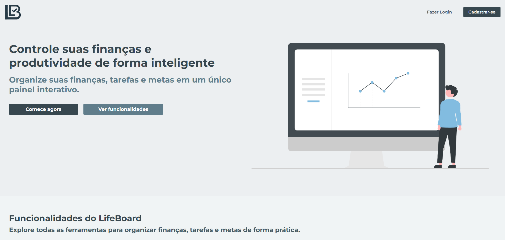
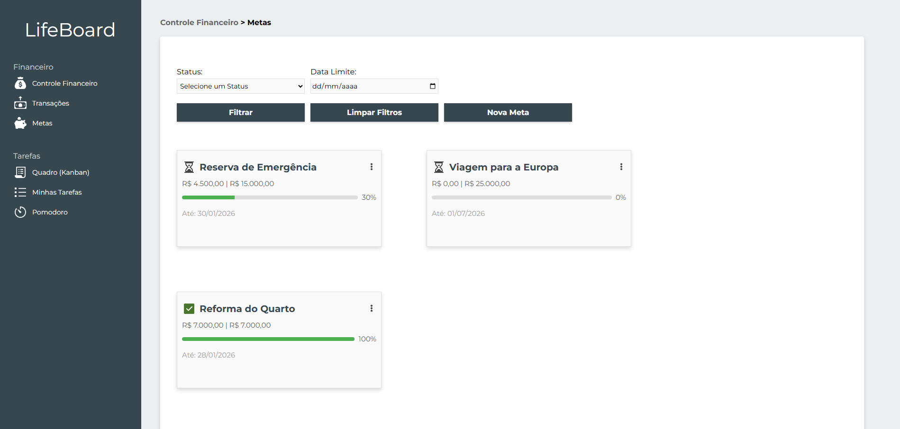
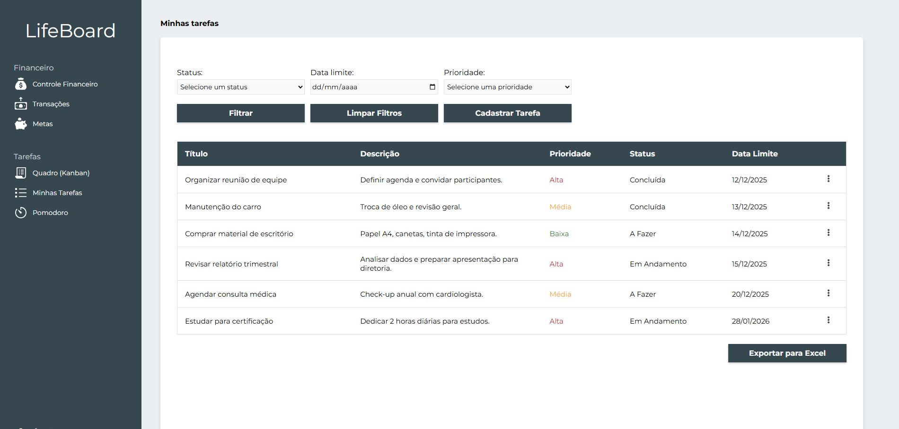
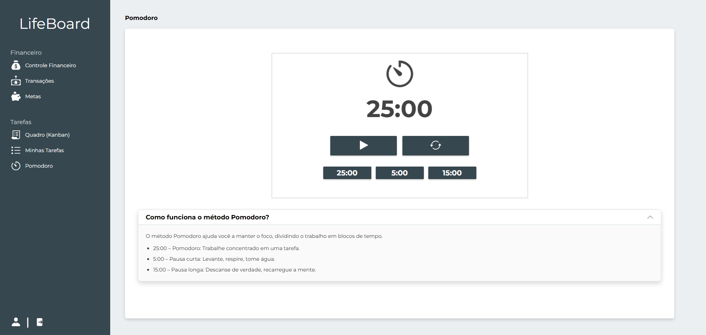
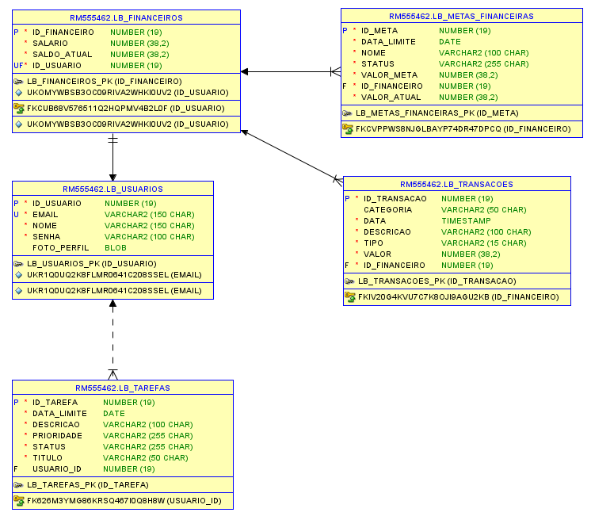

<h1>
  <span>
    
  </span>
  <span style="vertical-align: middle;">LifeBoard</span>
</h1>

O **LifeBoard** é uma plataforma integrada de **gestão financeira** e **produtividade pessoal**, desenvolvida para ajudar usuários a organizarem suas finanças e tarefas em um ambiente único, moderno e intuitivo. A solução combina recursos de controle financeiro, acompanhamento de metas e gerenciamento de tarefas, oferecendo uma visão completa do dia a dia para facilitar decisões e melhorar a organização pessoal.

---

## 📄 Páginas do Sistema

### 🏠 Página Inicial

A **Página Inicial do LifeBoard** apresenta uma visão clara e objetiva do propósito do sistema, reunindo informações essenciais sobre as funcionalidades da plataforma. Ela foi projetada para orientar novos usuários e facilitar o primeiro acesso às áreas principais do sistema.

Na Home, é possível encontrar:
- **Apresentação geral do projeto**, destacando a proposta de unir controle financeiro e produtividade.
- **Explicações rápidas** sobre cada módulo (finanças, metas, tarefas e pomodoro).
- Acesso direto para:
    - **Página de Login**
    - **Página de Cadastro**
- Layout responsivo e intuitivo, permitindo que o usuário compreenda rapidamente como navegar pelo sistema.



---

### 💰 Controle Financeiro Completo

A **área financeira do LifeBoard** oferece uma visão clara e atualizada da saúde econômica do usuário. Entre os principais recursos, destacam-se:

- Visualização do saldo total, salário registrado e gastos do mês atual.
- Gráfico histórico exibindo os gastos dos últimos 12 meses.
- Listagem das últimas transações para acompanhamento rápido.
- Exibição de metas financeiras diretamente no painel.


---

### 📑 Transações em Detalhe

A página de **Transações** oferece uma visão completa e organizada de todos os movimentos financeiros do usuário.

- Os dados são exibidos em uma tabela dinâmica e intuitiva, contendo:
- Descrição da transação
- Categoria (lazer, moradia, alimentação, saúde etc.)
- Data do movimento
- Tipo da transação (entrada, saída, aplicação em meta ou resgate)
- Valor


Além disso, é possível **exportar todas as transações para um arquivo XLSX**, permitindo análise externa, backup ou integração com outras ferramentas.

---

### 🎯 Gestão de Metas Financeiras 

O **módulo de metas** auxilia o usuário a planejar e acompanhar objetivos financeiros específicos. Cada meta apresenta:

- Nome
- Data limite
- Valor total
- Progresso exibido por uma **barra de acompanhamento**



É possível **adicionar ou retirar valores das metas**, sempre respeitando o saldo disponível no controle financeiro.

### 📋 Tarefas e Produtividade

Além do controle financeiro, o LifeBoard oferece **ferramentas completas para organização de tarefas**.

#### 🗂️ Quadro Kanban

As tarefas são exibidas em três colunas:

- A Fazer
- Em Andamento
- Concluídas

Cada tarefa apresenta:

- Prioridade
- Nome
- Descrição
- Data limite


Esse formato amplia a clareza visual e facilita o fluxo de trabalho.

#### 📝 Minhas Tarefas (Tabela)

Modo de visualização alternativo em formato de tabela, ideal para pesquisas e análises rápidas.



As tarefas também podem ser **exportadas para XLSX**, garantindo flexibilidade e integração com outras ferramentas.

---

### ⏱️ Pomodoro Integrado

Para apoiar foco e produtividade, o LifeBoard inclui um **temporizador Pomodoro** com ciclos de:

- 5 minutos
- 15 minutos
- 20 minutos



A página contém uma explicação sobre o método, ajudando o usuário a aplicar a técnica corretamente no dia a dia.

---

## 🏗️ Arquitetura da Solução

O **LifeBoard** foi construído com uma arquitetura moderna baseada em uma API REST robusta e um frontend altamente responsivo. A solução foi projetada para garantir segurança, escalabilidade, manutenção simples e ótima experiência do usuário.

### ☕ Backend (Java + Spring Boot)

O backend do LifeBoard foi desenvolvido com foco em confiabilidade, padronização e boas práticas de desenvolvimento. As principais tecnologias utilizadas incluem:

- **Java 21**
- **Spring Boot (Starter Web)**
- **Spring Security + JWT** para autenticação segura
- **JPA/Hibernate** para persistência de dados
- **Bean Validation** para validações robustas
- **Oracle Database** como banco relacional principal
- **Spring Doc / OpenAPI** para documentação dos endpoints
- **Lombok** para redução de código boilerplate
- **Spring DevTools** para agilizar o desenvolvimento
- **JUnit 5 + Spring Boot Test** para testes automatizados (unitários e integrados)
- **Mockito** para simulação de dependências e cenários de negócio

[🔗 GitHub – LifeBoard Backend](https://github.com/felipesora/lifeboard-backend)

### ⚛️ Frontend (React.js)

O frontend foi criado para entregar rapidez, fluidez e uma interface moderna. Utiliza componentes reutilizáveis, rotas bem estruturadas e integração simples com a API.

Principais tecnologias e ferramentas:

- **React.js**
- **Vite** como bundler para performance superior
- **TypeScript** para maior segurança e organização do código
- **React Router DOM** para gerenciamento de rotas
- **React DOM** para renderização
- **Styled-Components** para estilização dinâmica
- **Recharts** para gráficos de desempenho financeiro
- **Swiper** para carrosséis e elementos interativos
- **jwt-decode** para interpretação do token JWT
- **ExcelJS e FileSaver** para exportação de dados em XLSX

[🔗 GitHub – LifeBoard Frontend](https://github.com/felipesora/lifeboard-frontend)

### 📐 Modelagem do Banco de Dados

Abaixo está a modelagem utilizada no projeto:



### 🔗 Integração e Comunicação

A integração entre frontend e backend ocorre totalmente por meio de uma **API REST**, garantindo baixo acoplamento, flexibilidade e facilidade para futuras expansões, como aplicativos mobile ou microsserviços.

O projeto segue boas práticas de versionamento, padronização de commits, organização por camadas e desenvolvimento contínuo no GitHub.

---

## ⭐ Principais Funcionalidades

O **LifeBoard** integra **múltiplos recursos pensados para melhorar organização pessoal, disciplina financeira e produtividade diária**. Entre as principais funcionalidades, destacam-se:

### 🔐 Autenticação e Acesso

- **Login e Cadastro** com validações
- **Proteção de rotas**
- **Fluxo simples e acessível** desde a página inicial

### 💰 Controle Financeiro

- **Dashboard** com saldo total, salário e gastos do mês
- **Histórico dos últimos 12 meses** em gráfico
- **Últimas transações** exibidas no painel
- Vínculo direto com metas financeiras

### 📑 Transações

- **Tabela completa** com descrição, categoria, data, tipo e valor
- **Filtros e organização intuitiva**
- **Exportação para arquivo XLSX**
- **Integração com metas** (aplicações e resgates)

### 🎯 Metas Financeiras

- **Criação e acompanhamento de metas** com valor objetivo e prazo
- **Barra de progresso detalhada**
- **Depósito e retirada vinculados** ao saldo financeiro
- **Feedback visual de evolução**

### 📝 Gestão de Tarefas

- **Quadro Kanban** com listas “A Fazer”, “Em Andamento” e “Concluídas”
- **Tabela alternativa** para visualização consolidada
- **Exportação de tarefas para XLSX**
- **Informações completas**: prioridade, descrição e prazo

### ⏱️ Pomodoro Integrado

- **Temporizadores de 5, 15 e 20 minutos**
- Explicação do método
- **Auxilia foco e produtividade** durante execução de tarefas

---

## 🚀 Como Rodar o Projeto Completo

Este guia apresenta o passo a passo para executar o **LifeBoard** localmente, iniciando pelo **backend (Java + Spring Boot)** e, em seguida, pelo **frontend (React + Vite)**.

### 🔧 1. Backend — Java 21 + Spring Boot

#### 1.1. Pré-requisitos

Certifique-se de ter instalado:

- **Java 21**
- **Maven 3.9+**
- **Oracle Database** (local ou em container)
- **Postman/Insomnia** (opcional para testar API)

#### 1.2. Configuração do `application.properties`

No diretório: `src/main/resources/application.properties`

Configure conforme seu ambiente Oracle:

```properties
spring.datasource.url=${ORCL_URL}
spring.datasource.username=${ORCL_USERNAME}
spring.datasource.password=${ORCL_PASSWORD}
spring.datasource.driver-class-name=oracle.jdbc.driver.OracleDriver

spring.jpa.hibernate.ddl-auto=update
spring.jpa.show-sql=true
spring.jpa.properties.hibernate.format_sql=true

api.security.token.secret=${JWT_SECRET}
```

**Observações importantes:**

- O campo `jwt.secret` deve conter uma chave forte.
- Ajuste URL e credenciais do Oracle conforme sua instalação.
- O `ddl-auto=update` facilita o desenvolvimento (em produção, usar `validate`).

#### 1.3. Rodando o Backend

Abra o projeto na sua IDE (IntelliJ, Eclipse ou VS Code) e localize a classe principal: `src/main/java/com/lifeboard/LifeboardBackendJavaApplication.java`

Basta **clicar em “Run”** na classe `LifeboardBackendJavaApplication` para iniciar a aplicação.

Ou no diretório raiz do backend, execute:

```
mvn spring-boot:run
```

Após iniciar:

- API disponível em: [http://localhost:8080](http://localhost:8080)
- Swagger disponível em: [http://localhost:8080/swagger-ui/index.html](http://localhost:8080/swagger-ui/index.html)

### 🖥️ 2. Frontend — React + Vite + TypeScript

#### 2.1. Pré-requisitos

- **Node.js 18+**
- **NPM ou Yarn**

#### 2.2. Configuração do Frontend

No arquivo `.env` localizado na raiz do frontend, ajuste a URL da API para apontar para o backend Java:

```bash
VITE_API_URL=http://localhost:8080/api
```

#### 2.3. Instalando dependências

No diretório do frontend:

```bash
npm install
```

Ou:

```bash
yarn
```

#### 2.4. Rodando o Frontend

Para iniciar em modo desenvolvimento:
```bash
npm run dev
```

Aplicação disponível em:

[http://localhost:5173](http://localhost:5173) (porta padrão do Vite)

### 🔗 Comunicação entre Front e Back

O frontend se comunica com a API por meio do valor definido em:

```bash
VITE_API_URL=http://localhost:8080/api
```

Certifique-se de que:
- O backend está rodando sem erros.
- O frontend está apontando para o endereço correto.

---

## 🔗 Repositórios e Deploys

O **LifeBoard está dividido em dois repositórios principais** — um para o backend e outro para o frontend — além das versões hospedadas em produção para acesso público.

### 📦 Repositórios

- **Frontend (React + Vite + TypeScript):**

    [🔗 GitHub – LifeBoard Frontend](https://github.com/felipesora/lifeboard-frontend)

- **Backend (Java 21 + Spring Boot):**

    [🔗 GitHub – LifeBoard Backend](https://github.com/felipesora/lifeboard-backend)

### 🚀 Deploys

- **Aplicação Web (Frontend):**

    [🔗 Acessar LifeBoard Online]()

- **API REST (Backend):**

    [🔗 Documentação Web – Swagger / OpenAPI]()


> ⚠️ **Observação Importante**
>
> O backend do LifeBoard está hospedado no plano gratuito do **Render**, o que significa que o servidor entra em modo “sleep” após um período sem uso.  
> Por isso, ao acessar a aplicação, recomenda-se:
>
> 1️⃣ Acessar primeiro o **deploy do backend**  
> 2️⃣ Aguardar alguns segundos até que o serviço seja reativado  
> 3️⃣ Após o backend estar ativo, utilizar normalmente o **frontend**
>
> Isso garante que todas as funcionalidades sejam carregadas corretamente.

---

## 🎥 Demonstração do LifeBoard

Confira um vídeo apresentando o LifeBoard em funcionamento, mostrando as principais funcionalidades da plataforma, incluindo controle financeiro, metas, tarefas e pomodoro:

👉 **Assista ao vídeo demonstrativo:**

[🔗 Vídeo Demontrativo da Solução]()

---

## 👨‍💻 Autor
Desenvolvido por **Felipe Sora**

🔗 GitHub: https://github.com/felipesora

🔗 LinkedIn: https://www.linkedin.com/in/felipesora/